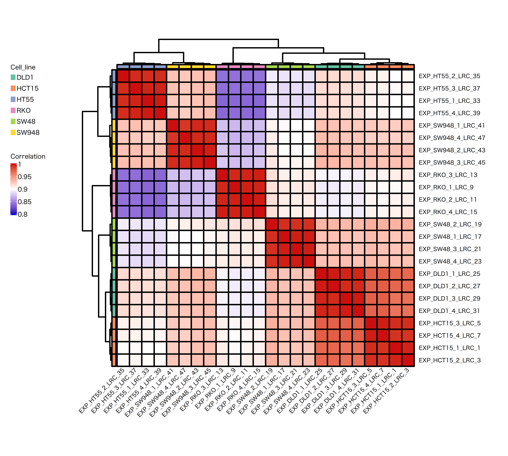
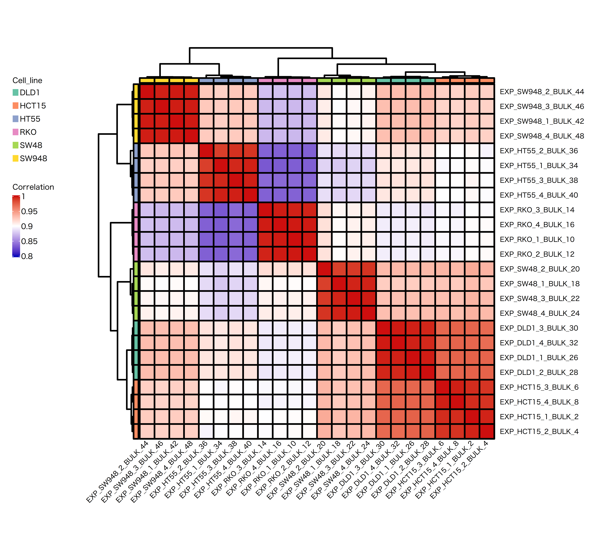
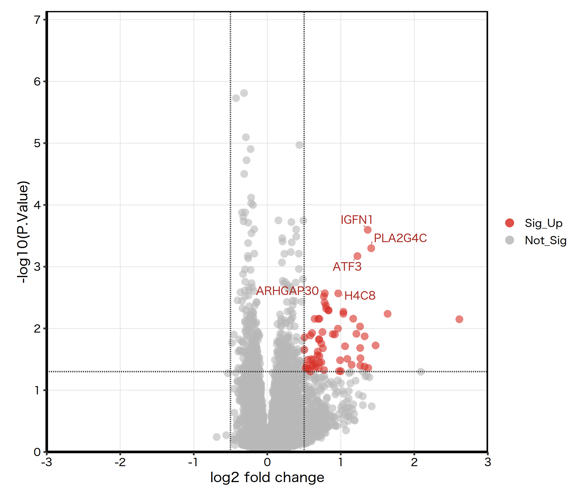
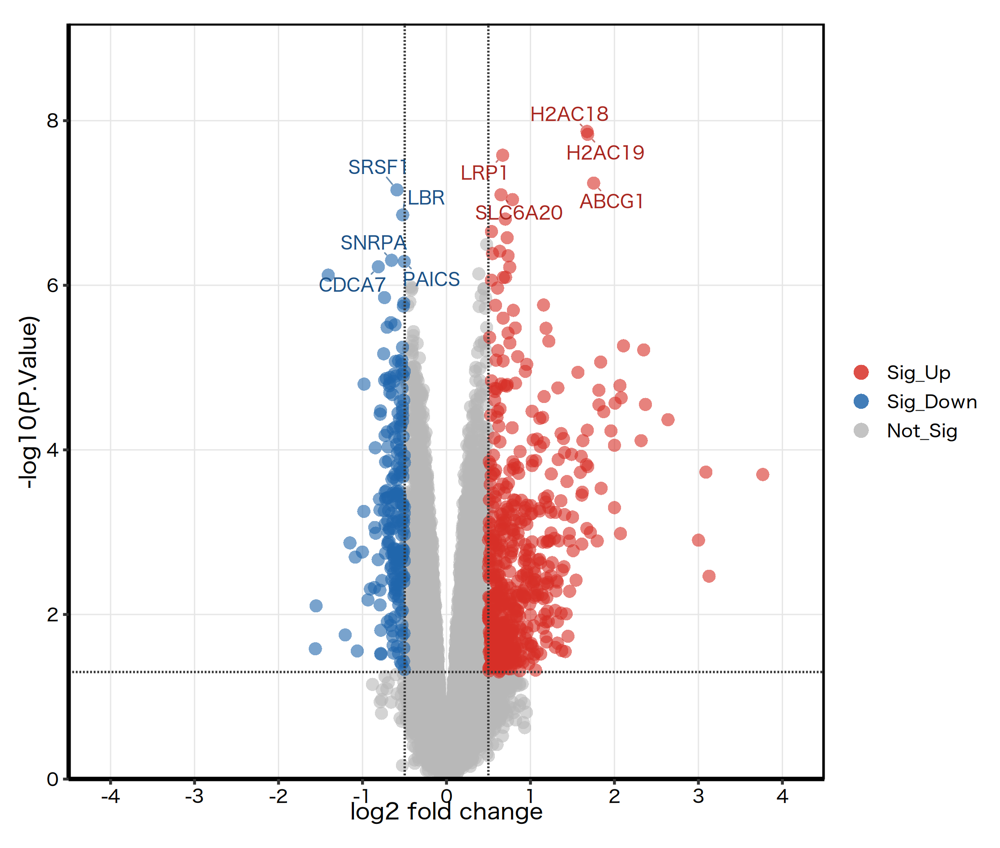
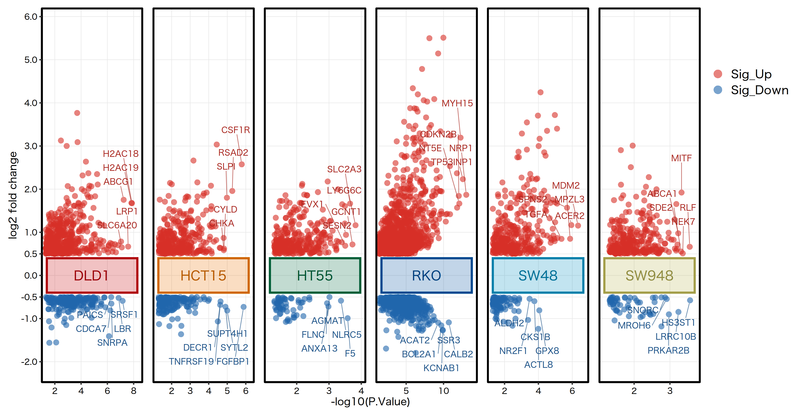
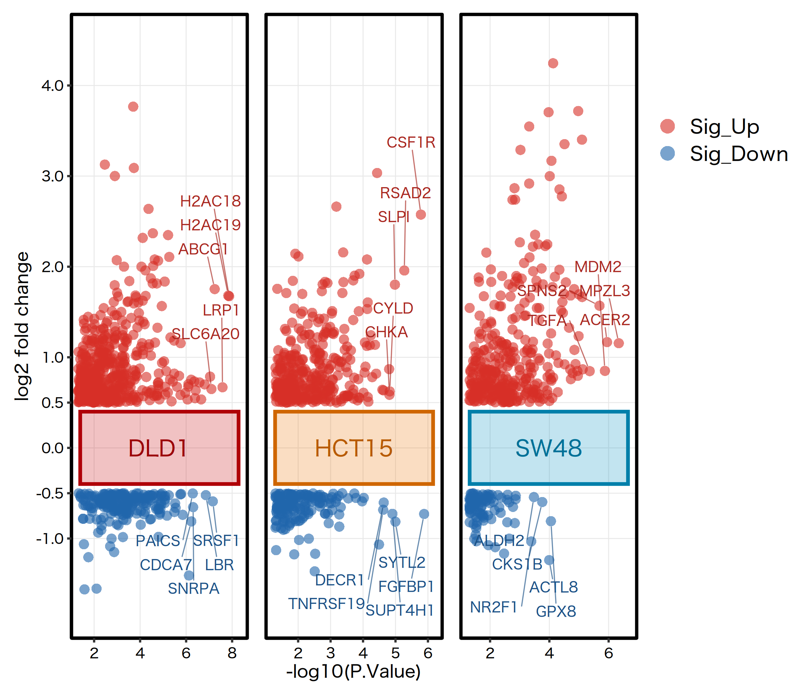
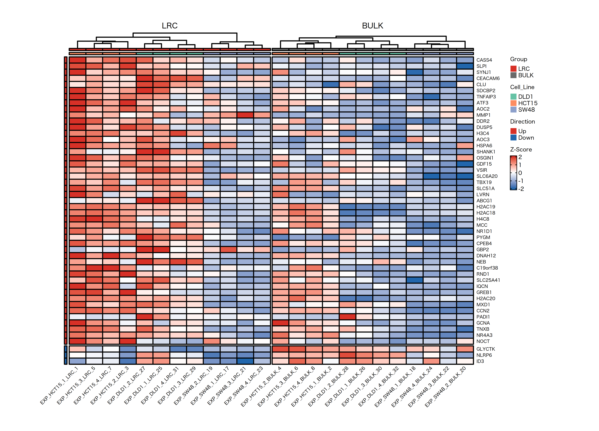

# 结直肠癌休眠细胞复苏的转录组分析项目

本项目围绕结直肠癌远处复发与播散性肿瘤细胞休眠这一问题，使用公开转录组数据集 GSE114012 建立一套可复现的候选基因筛选流程。当前阶段重点不是直接证明转移复发机制，而是先从 LRC/BULK 休眠模型中提取稳定的差异表达信号，为后续转录因子调控、通路富集、免疫微环境互作和药物重定位分析提供入口。

## 研究背景与核心假说

结直肠癌是全球常见恶性肿瘤之一。临床上一个长期存在的问题是，部分患者即使接受根治性手术，仍可能在数年甚至十余年后发生远处转移复发。越来越多的证据提示，部分癌细胞可能在疾病较早阶段已经播散，并定植于肝脏、肺脏或骨髓等远处器官，但这些播散性肿瘤细胞并不一定立即形成可见转移灶，而可能长期处于低增殖或静止状态。

本项目的核心假说是：结直肠癌复发并不只是“癌细胞是否播散”的问题，更关键的是休眠癌细胞是否被炎症、组织重塑、免疫微环境改变或代谢重编程等因素重新激活。若能识别并阻断促使休眠细胞复苏的关键转录调控轴或信号通路，可能使残留癌细胞长期维持休眠，从而降低复发与转移风险。

## 数据集与模型

当前分析使用 GEO 数据集 [GSE114012](https://www.ncbi.nlm.nih.gov/geo/query/acc.cgi?acc=GSE114012)。该数据集用于研究结直肠癌 spheroid 培养体系中的休眠细胞，实验设计使用 CFSE 标记并分选染料保留的 label-retaining cells, 即 LRC，与相对 cycling 的 BULK 细胞进行 RNA-seq 比较。

本项目将：

- `LRC` 作为休眠样细胞状态；
- `BULK` 作为相对增殖/循环状态；
- `LRC vs BULK` 作为识别休眠样表达特征的核心比较；
- DLD1、HCT15、HT55、SW948、RKO、SW48 六个结直肠癌细胞系作为跨模型验证基础。

## 项目目录结构

```text
data/ngs/GSE114012/
  data_prepare/                         # GSE114012预处理后的SE对象、临床信息和统计表

scripts/GSE114012/
  00_sample_clustering_heatmap.R         # LRC/BULK样本TPM层级聚类热图
  01_limma_differential_expression.R     # limma-voom差异表达分析
  02_intersect_significant_genes.R       # 显著差异基因交集分析
  03_volcano_plot.R                      # 传统火山图
  04_multiple_volcano_plot.R             # 多组火山图
  05_top_deg_gene_heatmap.R              # Top差异表达基因表达热图
  06_gsea_analysis.R                     # 批量GSEA分析与GseaVis绘图

scripts/functions/
  limma_de_functions.R                   # 差异分析公共函数
  plotting_common_functions.R            # 绘图公共配置与函数
  report_table_functions.R               # CSV/LaTeX/Markdown表格输出函数

scripts/beamer/
  beamer_report.tex                      # 汇报用Beamer源文件

results/ngs/GSE114012/
  tables/                                # 01号脚本输出的DEG结果
  intersect/                             # 02号脚本输出的交集结果
  plots/                                 # 各绘图脚本输出的PDF和PNG图片

data/reference/msigdb/                   # msigdbr本地缓存，默认7天自动刷新
temporary/ngs/GSE114012/GSEA_qs2_cache/  # GSEA对象和表达矩阵qs2缓存

results/reports/
  beamer/beamer_report.pdf               # 最终汇报PDF

temporary/
  beamer/                                # Beamer临时编译目录
```

## 分析流程

### 00. 样本层级聚类热图

脚本：`scripts/GSE114012/00_sample_clustering_heatmap.R`

该步骤从 SummarizedExperiment 对象中提取 TPM 表达矩阵，分别对全部 LRC 样本和全部 BULK 样本计算样本相关性，并进行 hierarchical clustering。样本名使用临床信息中的 `Title` 列。该图用于判断样本表达结构、细胞系来源和休眠样状态之间的关系，为后续差异分析提供质量控制依据。

输出图片同步保存为矢量 PDF 和 Markdown 可用 PNG：

- `results/ngs/GSE114012/plots/sample_clustering_heatmap/coding/LRC/heatmap.pdf`
- `results/ngs/GSE114012/plots/sample_clustering_heatmap/coding/LRC/heatmap.png`
- `results/ngs/GSE114012/plots/sample_clustering_heatmap/coding/BULK/heatmap.pdf`
- `results/ngs/GSE114012/plots/sample_clustering_heatmap/coding/BULK/heatmap.png`

LRC 样本聚类：



BULK 样本聚类：



### 01. LRC vs BULK 差异表达分析

脚本：`scripts/GSE114012/01_limma_differential_expression.R`

该步骤使用 `limma-voom` 对 RNA-seq count 矩阵进行差异表达分析。当前配置使用 coding 基因集合，显著性阈值为：

- P值列：`P.Value`
- P值阈值：`P.Value < 0.05`
- logFC阈值：`abs(logFC) > 0.5`

每个分析设计输出到：

```text
results/ngs/GSE114012/tables/<Analysis_Name>/DEG/
```

每个目录包含：

- `all_genes.csv`：完整差异分析结果；
- `significant_genes.csv`：显著差异基因；
- `summary.csv`：当前分析设计的统计汇总；
- 同名 `.tex`：用于 Beamer；
- 同名 `.md`：用于 Markdown 文档。

差异分析结果概览：

| Analysis_Name | Contrast | Samples_Used | Up | Down | Total_Significant_Genes | P_Value_Column | P_Value_Cutoff | LogFC_Cutoff |
| --- | --- | --- | --- | --- | --- | --- | --- | --- |
| ALL | ALL_vs_BULK | 48 | 65 | 0 | 65 | P.Value | 0.05 | 0.5 |
| DLD1_HCT15_SW48 | DLD1+HCT15+SW48_vs_BULK | 24 | 94 | 8 | 102 | P.Value | 0.05 | 0.5 |
| DLD1_HCT15 | DLD1+HCT15_vs_BULK | 16 | 57 | 7 | 64 | P.Value | 0.05 | 0.5 |
| DLD1 | DLD1_vs_BULK | 8 | 541 | 213 | 754 | P.Value | 0.05 | 0.5 |
| HCT15 | HCT15_vs_BULK | 8 | 362 | 161 | 523 | P.Value | 0.05 | 0.5 |
| HT55 | HT55_vs_BULK | 8 | 307 | 60 | 367 | P.Value | 0.05 | 0.5 |
| RKO | RKO_vs_BULK | 8 | 1252 | 627 | 1879 | P.Value | 0.05 | 0.5 |
| SW48 | SW48_vs_BULK | 8 | 353 | 96 | 449 | P.Value | 0.05 | 0.5 |
| SW948 | SW948_vs_BULK | 8 | 305 | 57 | 362 | P.Value | 0.05 | 0.5 |

Markdown 表格预览示例：

- `results/ngs/GSE114012/tables/ALL/DEG/summary.md`
- `results/ngs/GSE114012/tables/DLD1/DEG/significant_genes.md`
- `results/ngs/GSE114012/tables/RKO/DEG/all_genes.md`

### 02. 显著差异基因交集分析

脚本：`scripts/GSE114012/02_intersect_significant_genes.R`

该步骤读取 01 号脚本输出的 `significant_genes.csv`，按脚本头部的 `INTERSECTION_SCHEMES` 配置提取多套交集方案。交集后的基因列表仅保留基因注释列，交集基因在各差异分析中的 DEG 结果单独保存到对应分析子目录中。

输出目录：

```text
results/ngs/GSE114012/intersect/<INTERSECTION_SCHEME>/
```

交集统计概览：

| Scheme | Selected_Analyses | DEG_Result_Analyses | Total_Intersected_Genes | Common_Up | Common_Down | Mixed_Direction |
| --- | --- | --- | --- | --- | --- | --- |
| DLD1_HCT15 | DLD1;HCT15 | DLD1;HCT15 | 102 | 85 | 7 | 10 |
| DLD1_HCT15_SW48 | DLD1;HCT15;SW48 | DLD1;HCT15;SW48 | 19 | 17 | 1 | 1 |
| HT55_SW948 | HT55;SW948 | HT55;SW948 | 49 | 43 | 2 | 4 |
| SW948_RKO | SW948;RKO | SW948;RKO | 83 | 68 | 1 | 14 |

交集结果解释：

- `DLD1_HCT15` 交集基因最多，提示这两个模型之间存在较多共享的 LRC 休眠样表达改变；
- `DLD1_HCT15_SW48` 更严格，保留 19 个跨三模型重复出现的候选基因，更适合作为后续 TF/通路精筛入口；
- `Common_Up` 和 `Common_Down` 可以帮助区分稳定方向一致的休眠维持信号与可能具有模型特异性的混合方向信号。

Markdown 表格预览示例：

- `results/ngs/GSE114012/intersect/DLD1_HCT15_SW48/summary.md`
- `results/ngs/GSE114012/intersect/DLD1_HCT15_SW48/gene_list.md`
- `results/ngs/GSE114012/intersect/DLD1_HCT15_SW48/DLD1/deg_results.md`

### 03. 传统火山图

脚本：`scripts/GSE114012/03_volcano_plot.R`

传统火山图展示每个分析设计中基因的 `logFC` 与 `-log10(P.Value)` 分布。红色表示 `Sig_Up`，蓝色表示 `Sig_Down`，灰色表示 `Not_Sig`。标注基因可在脚本头部手动配置；若不配置，则自动标注每组 Up 5 个和 Down 5 个 top 基因。

代表性结果：





全部 PNG 输出：

- `results/ngs/GSE114012/plots/volcano/ALL/volcano_plot.png`
- `results/ngs/GSE114012/plots/volcano/DLD1/volcano_plot.png`
- `results/ngs/GSE114012/plots/volcano/DLD1_HCT15/volcano_plot.png`
- `results/ngs/GSE114012/plots/volcano/DLD1_HCT15_SW48/volcano_plot.png`
- `results/ngs/GSE114012/plots/volcano/HCT15/volcano_plot.png`
- `results/ngs/GSE114012/plots/volcano/HT55/volcano_plot.png`
- `results/ngs/GSE114012/plots/volcano/RKO/volcano_plot.png`
- `results/ngs/GSE114012/plots/volcano/SW48/volcano_plot.png`
- `results/ngs/GSE114012/plots/volcano/SW948/volcano_plot.png`

### 04. 多组火山图

脚本：`scripts/GSE114012/04_multiple_volcano_plot.R`

多组火山图将多个细胞系或组合分析并列展示，只绘制达到阈值的 `Sig_Up` 和 `Sig_Down` 基因。横轴为 `-log10(P.Value)`，纵轴为真实 `logFC`，每个分组拥有独立横轴范围，但宽度保持一致，便于横向比较不同模型中显著基因的分布和方向。

代表性结果：





全部 PNG 输出：

- `results/ngs/GSE114012/plots/multiple_volcano/ALL/multiple_volcano_plot.png`
- `results/ngs/GSE114012/plots/multiple_volcano/DLD1_HCT15_SW48/multiple_volcano_plot.png`
- `results/ngs/GSE114012/plots/multiple_volcano/DLD1_HCT15/multiple_volcano_plot.png`
- `results/ngs/GSE114012/plots/multiple_volcano/SW48_RKO/multiple_volcano_plot.png`
- `results/ngs/GSE114012/plots/multiple_volcano/HT55_SW948/multiple_volcano_plot.png`
- `results/ngs/GSE114012/plots/multiple_volcano/COMBINATION_1/multiple_volcano_plot.png`

### 05. Top差异表达基因表达热图

脚本：`scripts/GSE114012/05_top_deg_gene_heatmap.R`

该步骤自动读取每一种差异分析设计中的 `significant_genes.csv`，按 P 值和 logFC 幅度提取最多 Top 50 个显著差异基因，并使用 SE 对象中的 TPM 表达量绘制表达热图。热图主体展示 `log2(TPM + 1)` 后的行 Z-score，顶部注释样本分组和细胞系；图中统一将实验组显示为 `LRC`、对照组显示为 `BULK`，并固定 LRC 在左、BULK 在右。

该图用于直观判断显著差异基因在 LRC 与 BULK 样本之间是否形成稳定表达模式，也可以帮助检查候选基因是否受细胞系差异或休眠样状态共同驱动。热图红蓝配色与火山图显著基因配色保持一致，右侧图例与基因名之间保留适当留白，便于汇报展示。

代表性结果：



全部 PNG 输出：

- `results/ngs/GSE114012/plots/gene_heatmap/ALL/gene_heatmap.png`
- `results/ngs/GSE114012/plots/gene_heatmap/DLD1/gene_heatmap.png`
- `results/ngs/GSE114012/plots/gene_heatmap/DLD1_HCT15/gene_heatmap.png`
- `results/ngs/GSE114012/plots/gene_heatmap/DLD1_HCT15_SW48/gene_heatmap.png`
- `results/ngs/GSE114012/plots/gene_heatmap/HCT15/gene_heatmap.png`
- `results/ngs/GSE114012/plots/gene_heatmap/HT55/gene_heatmap.png`
- `results/ngs/GSE114012/plots/gene_heatmap/RKO/gene_heatmap.png`
- `results/ngs/GSE114012/plots/gene_heatmap/SW48/gene_heatmap.png`
- `results/ngs/GSE114012/plots/gene_heatmap/SW948/gene_heatmap.png`

### 06. 批量GSEA通路富集分析

脚本：`scripts/GSE114012/06_gsea_analysis.R`

该步骤自动读取每一种差异分析设计中的 `all_genes.csv`，以 limma 的 `t` 统计量构建排序基因列表，并使用 `clusterProfiler::GSEA` 对 msigdbr 当前数据库中的全部可用基因集类别进行批量 GSEA。当前脚本设置：

- 物种：`human`
- 基因ID：`Entrez`
- 排序统计量：`t`
- 基因集配置：`GSEA_GENESETS_TO_RUN <- "all"`
- 结果 readable：开启，`core_enrichment` 中的基因会转换为 Symbol，便于直接阅读；
- msigdbr 缓存：`data/reference/msigdb/`
- qs2 加速缓存：`temporary/ngs/GSE114012/GSEA_qs2_cache/`

每个分析设计、每类基因集均输出到独立目录：

```text
results/ngs/GSE114012/tables/<Analysis_Name>/GSEA/<GeneSet_Name>/
results/ngs/GSE114012/plots/GSEA/<Analysis_Name>/<GeneSet_Name>/
```

全量运行结果：

- GSEA结果表：234 套，每套保存 `csv/md/tex`；
- GSEA dotplot：234 张，每张保存 `pdf/png`；
- 单通路 GSEA + 核心基因表达热图：2057 张，每张保存 `pdf/png`；
- 全局GSEA summary：`results/ngs/GSE114012/tables/GSEA_summary/summary.csv`

代表性结果概览：

| Analysis_Name | GeneSet_Name | Ranked_Genes | GSEA_Terms | Positive_NES | Negative_NES | Single_Pathway_Plots |
| --- | --- | --- | --- | --- | --- | --- |
| ALL | hallmark | 12964 | 34 | 21 | 13 | 10 |
| ALL | GO_BP | 12964 | 1443 | 838 | 578 | 10 |
| ALL | C6 | 12964 | 95 | 75 | 20 | 10 |
| DLD1_HCT15_SW48 | hallmark | 12840 | 32 | 18 | 14 | 10 |
| DLD1_HCT15_SW48 | GO_BP | 12840 | 1216 | 710 | 477 | 10 |
| DLD1_HCT15_SW48 | C6 | 12840 | 81 | 59 | 22 | 10 |

代表性 dotplot：


代表性单通路图：


## Beamer 汇报文件

当前汇报文件已经整合 00 到 06 的主要结果。

- TeX 源文件：`scripts/beamer/beamer_report.tex`
- 最终 PDF：`results/reports/beamer/beamer_report.pdf`
- 中间编译目录：`temporary/beamer/`

## 复现命令

建议按编号顺序运行：

```bash
Rscript scripts/GSE114012/00_sample_clustering_heatmap.R
Rscript scripts/GSE114012/01_limma_differential_expression.R
Rscript scripts/GSE114012/02_intersect_significant_genes.R
Rscript scripts/GSE114012/03_volcano_plot.R
Rscript scripts/GSE114012/04_multiple_volcano_plot.R
Rscript scripts/GSE114012/05_top_deg_gene_heatmap.R
Rscript scripts/GSE114012/06_gsea_analysis.R
```

Beamer 编译命令：

```bash
mkdir -p temporary/beamer results/reports/beamer
latexmk -xelatex \
  -synctex=1 \
  -interaction=nonstopmode \
  -file-line-error \
  -outdir=temporary/beamer \
  -auxdir=temporary/beamer \
  -shell-escape \
  scripts/beamer/beamer_report.tex
cp temporary/beamer/beamer_report.pdf results/reports/beamer/beamer_report.pdf
```

## 后续分析方向

当前结果为休眠样 LRC 与 cycling BULK 的 bulk RNA-seq 候选基因筛选阶段。后续可以沿以下方向继续推进：

1. 使用 dormancy markers 建立休眠评分，并结合 proliferation score 区分休眠型、过渡型、苏醒型和增殖型细胞状态。
2. 在单细胞数据中比较休眠型 vs 苏醒型，寻找复苏相关 TF、通路和细胞周期重启信号。
3. 使用 SCENIC、DoRothEA、pySCENIC 或 ChIP-X enrichment 识别导致苏醒的转录因子调控网络。
4. 使用 Monocle3、Slingshot 或 CytoTRACE 构建休眠到复苏再到增殖的伪时间轨迹。
5. 使用 GSVA/GSEA 解析复苏相关通路，重点关注 TGF-beta、IL6/STAT3、YAP/TAZ、NF-kappaB、WNT/beta-catenin 等轴。
6. 在肿瘤微环境数据中分析 M2 macrophage、TREM2/APOE macrophage、CAF、Treg 和 exhausted CD8 T cell 是否与苏醒状态共现。
7. 使用 CellChat 或 NicheNet 推断癌细胞与免疫/基质细胞互作。
8. 将“苏醒型上调基因”和关键 TF 靶基因输入 CMap、LINCS、DGIdb 或 Enrichr Drug Signatures，筛选可逆转复苏 signature、维持休眠状态的候选药物。

## 当前阶段结论

GSE114012 的 LRC/BULK 模型为结直肠癌休眠样细胞提供了一个可操作的转录组入口。当前结果显示，不同 CRC 细胞系中 LRC 相对 BULK 存在程度不同的显著表达改变，其中 RKO、DLD1、HCT15 等模型的差异信号更丰富。通过交集分析可以进一步提取跨模型重复出现、方向相对稳定的候选基因，为后续围绕“休眠维持”和“休眠细胞复苏”的调控网络分析打下基础。
